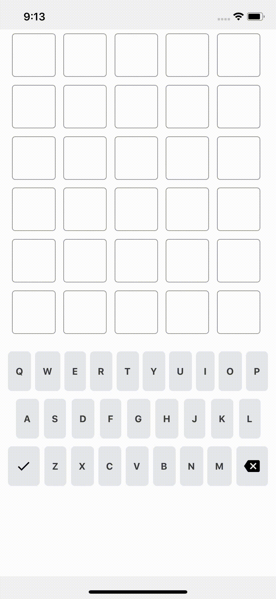

# [react-native-wordle](https://amusoftech.xyz/)
# [Docs are here](./docs/)
Popular wordle game with  React Native.
####  Dark Mode Enabled 🔆
## Requirements

- [Node](https://nodejs.org) `6.x` or newer
- [React Native](http://facebook.github.io/react-native/docs/getting-started.html) for development
- [Xcode](https://developer.apple.com/xcode/) for iOS development
- [Android Studio](https://developer.android.com/studio/index.html) for Android development
- [Android SDK](https://developer.android.com/sdk/) `23.0.1` or newer for Android development
- [Android Marshmallow](https://www.android.com/versions/marshmallow-6-0/) or newer on your Android device to test properly



 
## Get Started

#### 1. Installation

On the command prompt run the following commands

```sh
$ git clone https://github.com/noddy1996/react-native-redux-starter.git

$ cd react-native-redux-starter/

$ npm install
```

#### 2. Simulate for iOS

```sh
$ cd ios && pod install
```

**Method One**

- Open the project in Xcode from **ios/react_native_redux_starter.xcodeproj**.

- Hit the play button.

**Method Two**

- Run the following command in your terminal.

```sh
$ react-native run-ios
```

#### 3. Simulate for Android

- Make sure you have an **Android emulator** installed and running.

- Run the following command in your terminal.

```sh
$ react-native run-android
```
 

<a href="https://www.buymeacoffee.com/amusoftech" target="_blank"></a>
